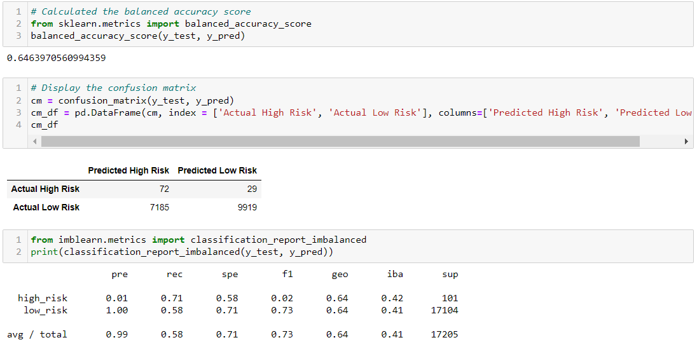
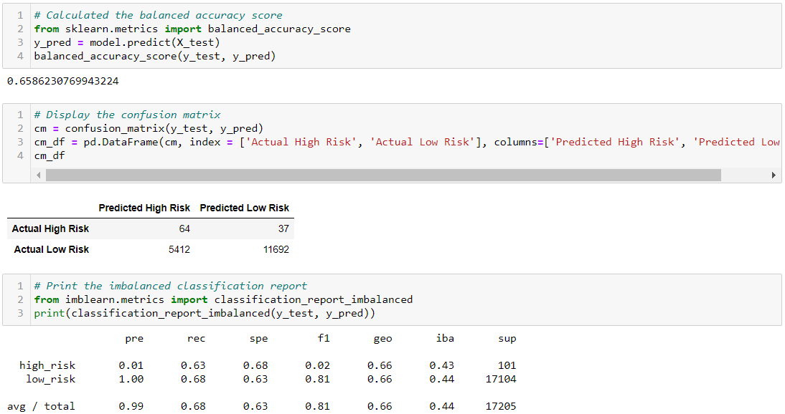
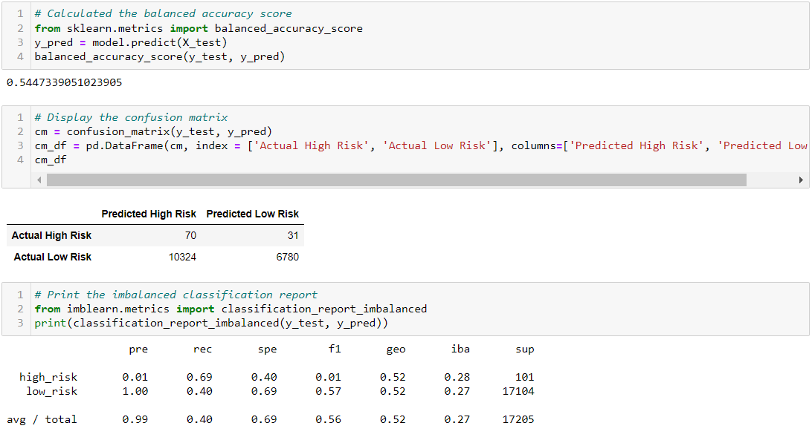
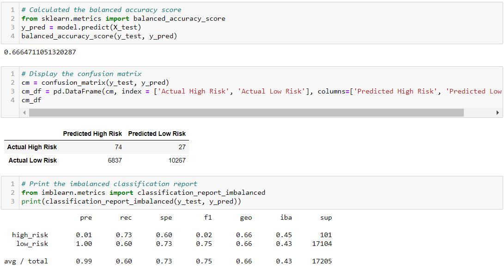
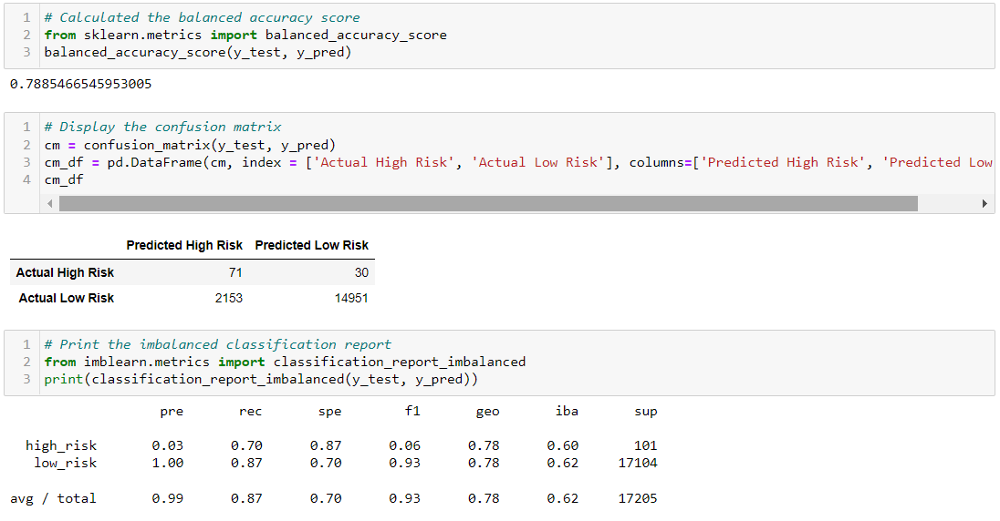
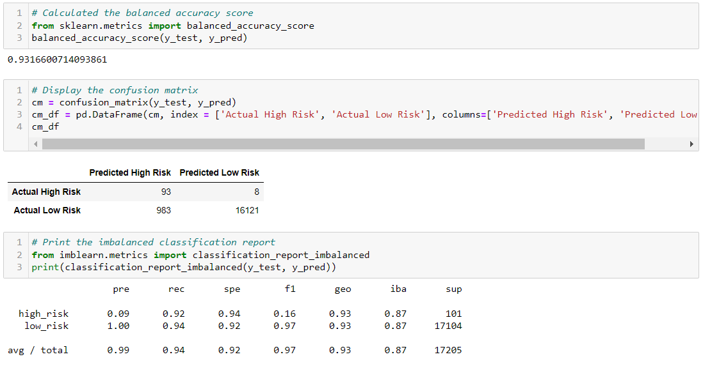

# Credit Risk Analysis

## Overview of the loan prediction risk analysis:

Using the credit card credit dataset from LendingClub, a peer-to-peer lending services company, I've been tasked with implementing and evaluating machine learning models using the imbalanced-learn and scikit-learn libraries to predict credit risk in potential applicants. 

## Technology Required:
-   Python
    -   Anaconda
    -   Jupyter Notebook
    -   
-   Libraries
    -   NumPy
    -   SciPy
    -   Scikit-Learn

## Results:

In all of the following examples, we have cleaned the data and identified the 'Loan Status' as our target, splitting the data into our X and y training and test groups. For each model we have also selected Random State 1 in order to compare all model results fairly.

### Logistic Regression Models
---

- Random Oversampling
     

- Oversampling (SMOTE)
     

- Undersampling (Cluster Centroids)
     

-  Combination Sampling (SMOTEENN)
      

### Ensamble Learning Models
---

-   Balanced Random Forest Classifier
    

-   Easy Ensamble Classifier
    

## Summary:

With the largest risk factor in determining credit risk being a credit applicant of high risk being approved as if they were low risk, our main objective in testing our models is to determine overall model accuracy and the sensitivity (recall) of the models "Hish Risk" identifier. After reviewing all models tested, the recommendation would be to use the Easy Ensamble Classifier method. With an Accuracy Score of 93% and a "High Risk" sensitivity of 92%, none of the other models are able to as accurately predict the number of High Risk applicants within a pool this large.

